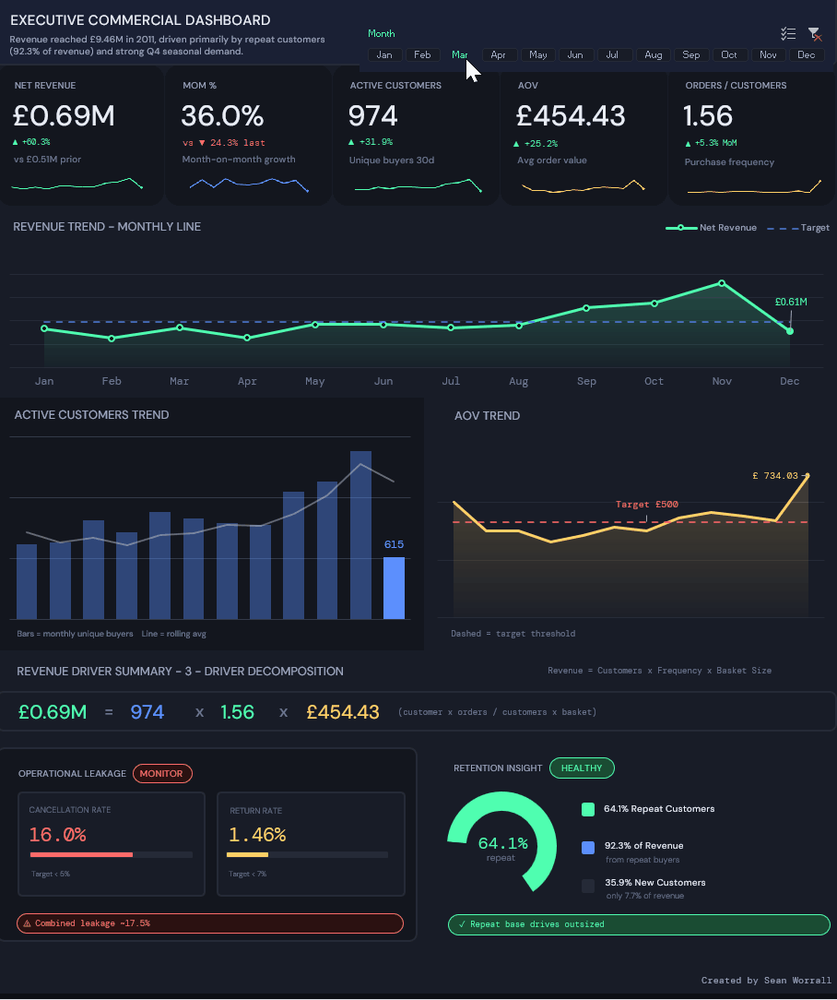
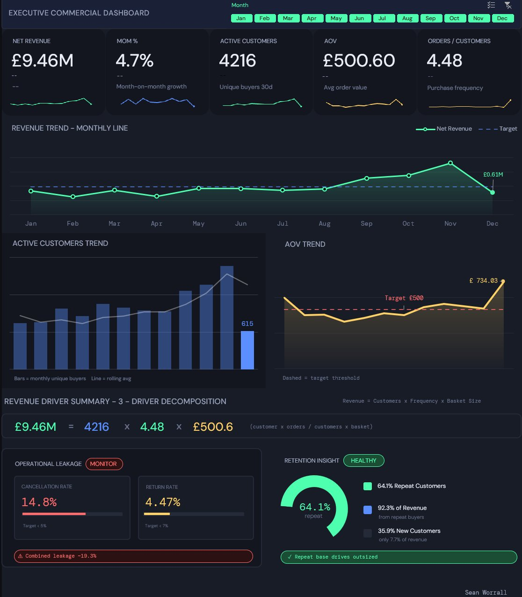
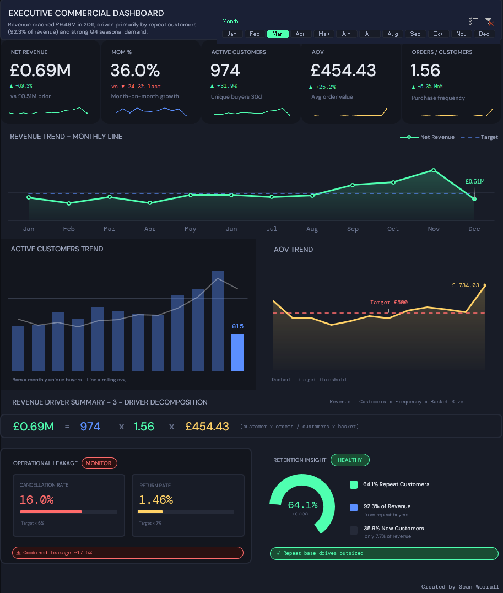
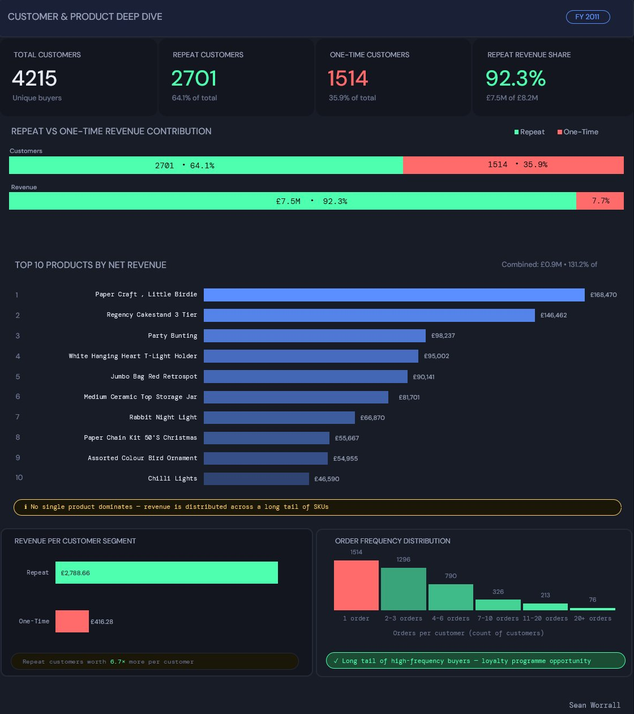
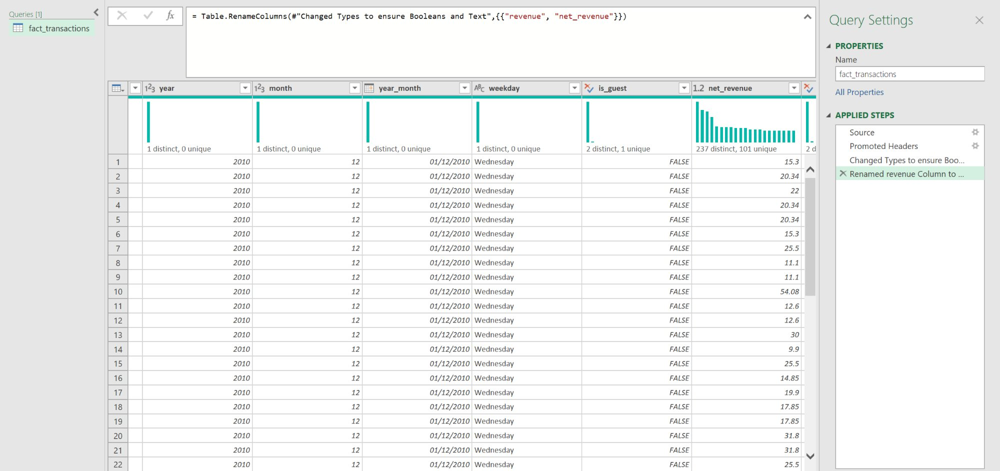
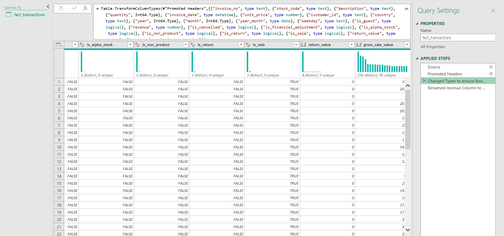

[README.md](https://github.com/user-attachments/files/25969628/README.md)
<h1 align="center">E-Commerce Analytics</h1>
<h3 align="center">Executive Dashboards in Excel &nbsp;·&nbsp; Data Cleaning in Python</h3>

  
  
  

<em>An end-to-end analytics project: raw Kaggle dataset through to interactive executive dashboards in Excel.</em>

### Key Insights

• £9.46M revenue analysed across 541k transactions  
• 64.1% repeat customers generate 92.3% of revenue  
• 14.8% order cancellation rate impacting sales

---

<h2>Dashboards</h2>

<h3>Dashboard 1 — Executive Commercial Overview</h3>

A slicer-driven dashboard that lets you drill into any month or view the full year at a glance. KPI cards with month-on-month change indicators, revenue trend, customer activity, AOV tracking, a 3-driver revenue decomposition, operational leakage metrics, and a retention donut.

Select a month, and everything updates. The KPI cards show that month's figures, the change indicators flip between green and red based on trend direction, and the revenue driver equation recalculates to decompose that month's revenue into Customers × Frequency × Basket Size.

<h3>Dashboard 2 — Customer & Product Deep Dive</h3>

A static full-year view focused on customer segmentation and product concentration. Repeat vs one-time revenue split, top 10 products by revenue, revenue per customer segment, and order frequency distribution.

---

<h2>The Problem</h2>

I had a raw transactional dataset from a UK online retailer (541,909 rows) and wanted to answer the kinds of questions a commercial team would actually ask:

<ul>
  <li>How is revenue trending, and what is driving changes month to month?</li>
  <li>How much of our revenue depends on repeat customers?</li>
  <li>Where are we leaking revenue through cancellations and returns?</li>
  <li>Is product revenue concentrated or diversified?</li>
  <li>What does the customer frequency distribution look like?</li>
</ul>

The goal was to build something that looked and felt like a professional BI tool, but built entirely in Excel to demonstrate that you do not always need Tableau or Power BI to deliver strong analytical outputs.

---

<h2>The Dataset</h2>

The <a href="https://www.kaggle.com/datasets/carrie1/ecommerce-data">Online Retail Dataset</a> from Kaggle. All transactions for a UK-based online retailer between December 2010 and December 2011. Each row is a line item on an invoice, with fields for product, quantity, price, customer ID, and country.

The raw data is messy. Cancellations mixed in with sales, returns coded as negative quantities, missing customer IDs, test transactions, bad debt adjustments, and non-product stock codes like postage and bank charges. It needed substantial cleaning before any analysis could happen.

---

<h2>The Process</h2>

<h3>1. Data Cleaning &amp; Preparation (Python)</h3>

The full notebook is in <a href="data-cleaning/data_cleaning_notebook.ipynb"><code>data-cleaning/data_cleaning_notebook.ipynb</code></a> and a detailed write-up of every decision is in <a href="data-cleaning/cleaning-notes.md">cleaning-notes.md</a>.

The key principle was <strong>flag, don't delete</strong>. Instead of dropping cancellations and returns, I created boolean flag columns (<code>is_sale</code>, <code>is_cancelled</code>, <code>is_return</code>, <code>is_financial_adjustment</code>, <code>is_non_product</code>, <code>is_guest</code>) so every row is preserved and the data can be filtered dynamically in Excel. This means I can calculate cancellation rate <em>and</em> clean revenue from the same dataset.

Highlights of the cleaning process:

<ul>
  <li>CamelCase column names converted to snake_case (with a bug fix for acronyms like <code>CustomerID</code> which initially converted to <code>customer_i_d</code>)</li>
  <li>Non-breaking space characters stripped from product descriptions</li>
  <li>~25% of transactions had no customer ID — flagged as guest rather than deleted, preserving ~15% of revenue</li>
  <li>5,268 genuine full-row duplicates identified and removed after manual verification</li>
  <li>Transaction classification framework built using description pattern matching and stock code format to separate real product sales from financial adjustments, postage, and admin entries</li>
  <li>Three revenue columns engineered: <code>net_revenue</code>, <code>return_value</code>, <code>gross_sale_value</code></li>
</ul>

<h3>2. Data Modelling (Excel Power Pivot)</h3>

The cleaned data was loaded into Excel's Data Model through Power Query as <code>fact_transactions</code>. A small number of transformation steps were applied in Power Query to ensure correct data types (booleans, dates, text for ID columns) and to rename the revenue column to <code>net_revenue</code>.

  
  

Multiple pivot tables were built on a KPIs sheet, each filtered to different slices:

<ul>
  <li>Monthly revenue breakdown with calculated columns for AOV, Revenue per Customer, Orders per Customer, and MoM % changes</li>
  <li>Product revenue pivot showing the top 10 products by net revenue</li>
  <li>Customer cohort pivot breaking customers into Repeat vs One-Time segments</li>
  <li>Cancellation and return rate calculations from the flag columns</li>
</ul>

A CUBEVALUE reference table was added to provide slicer-proof monthly data. This reads directly from the Data Model, completely independent of the pivot tables, so charts and subtitle formulas always show the full 12-month trend regardless of which month the slicer has selected.

<h3>3. Dashboard 1 — Executive Commercial Overview</h3>

The interactive dashboard. Key technical details:

<strong>KPI Cards</strong> are rounded rectangle shapes with text boxes layered on top. Labels are typed in statically. Values are text boxes linked to GETPIVOTDATA helper cells that return the Grand Total of the filtered pivot — when the slicer selects a month, the Grand Total becomes that month's value.

<strong>Change indicators</strong> use Excel's icon set conditional formatting (green up-arrow, red down-arrow) applied to cells holding MoM % values. Separate conditional formatting rules change the font colour to match the icon. Fully automatic, no VBA needed. I used <a href="https://claude.ai">Claude</a> to help work through the conditional formatting logic for dynamically colouring the text alongside the icon sets.

<strong>Subtitle formulas</strong> like "vs £0.51M prior" use INDEX/MATCH against the CUBEVALUE reference table. The formula detects whether a month is selected and shows "--" when no month is filtered. Working through the CUBEVALUE syntax for the Data Model pivots involved some troubleshooting with <a href="https://claude.ai">Claude</a>, particularly getting the dimension member strings and filter criteria to match correctly.

<strong>Charts</strong> reference the CUBEVALUE column so they always display all 12 months. The revenue trend is a combo chart (area + line) with gradient fill, a dashed target line, and a highlighted endpoint marker.

<strong>The revenue driver equation</strong> recalculates dynamically. When a single month is selected, it shows that month's values from the reference table. When no month is selected, it divides the Grand Totals (total revenue / total invoices for AOV, total invoices / total customers for frequency) rather than summing monthly averages, which would be mathematically incorrect.

<h3>4. Dashboard 2 — Customer &amp; Product Deep Dive</h3>

A simpler static dashboard for the full year, deliberately isolated from Dashboard 1's slicers. It pulls from the Cohort Analysis sheet (no pivot tables, no slicer connections) and the product pivot. Stacked bars, horizontal bar charts, and a histogram — all standard Excel charts formatted with the same dark colour palette.

---

<h2>What I Learned</h2>

<strong>GETPIVOTDATA with Data Model pivots</strong> is essential when pivot tables collapse under slicer filtering. Fixed cell references break because rows physically shift. GETPIVOTDATA finds values by field name regardless of layout.

<strong>CUBEVALUE</strong> is the answer when you need data completely independent of pivot filters. It reads the Data Model directly, and you can make it dynamic by concatenating cell references into the dimension strings. Getting the syntax right for boolean filter fields (is_sale, is_cancelled) took some experimentation.

<strong>You cannot sum averages.</strong> When the revenue driver equation shows the full year, AOV and Orders per Customer must be recalculated from the totals (total revenue / total invoices), not summed across 12 monthly values. This is a basic but easy-to-miss analytical principle.

<strong>MoM % comparison direction matters.</strong> The change indicators compare the current month's MoM % minus the prior month's MoM %. If the current month growth is -13% and last month was +0.5%, the difference is -13.5pp, so the arrow points down. Simply showing last month's +0.5% as a green up-arrow would be misleading.

<strong>Separating data from presentation</strong> makes everything easier. Keeping the raw data, pivot calculations, and visual dashboard on separate sheets means you can update source data without breaking the layout.

---

<h2>Tools Used</h2>

<table>
  <tr><td><strong>Python</strong></td><td>Data cleaning and enrichment (pandas). Full notebook in the repo.</td></tr>
  <tr><td><strong>Power Query</strong></td><td>Loading the cleaned CSV into Excel's Data Model with correct data types.</td></tr>
  <tr><td><strong>Power Pivot</strong></td><td>Data Model for distinct counts, CUBEVALUE reference table.</td></tr>
  <tr><td><strong>Excel</strong></td><td>Pivot tables, GETPIVOTDATA, CUBEVALUE, INDEX/MATCH, conditional formatting, shapes, charts.</td></tr>
</table>

No VBA or macros in the final dashboards. Everything runs on native Excel formulas and features.

---

<h2>Repository Contents</h2>

<pre>
├── README.md
├── Dashboards.xlsx
├── screenshots/
│   ├── dashboard1-full-year.png
│   ├── dashboard1-filtered-march.png
│   ├── dashboard2-customer-product.png
│   ├── power-query-columns-left.png
│   ├── power-query-columns-right.png
│   └── dashboard-demo.gif
├── data-cleaning/
│   ├── data_cleaning_notebook.ipynb
│   └── cleaning-notes.md
├── data/
│   └── cleaned_data_sample.csv
└── docs/
    ├── data-dictionary.md
    └── methodology.md
</pre>

<blockquote>
  <strong>Note:</strong> The Dashboards Excel workbook is included with the raw data removed to reduce file size. It contains all pivot tables, KPI calculations, the CUBEVALUE reference table, the Cohort Analysis sheet, and both dashboards with their shapes, charts, and formulas intact. The raw dataset is freely available on <a href="https://www.kaggle.com/datasets/carrie1/ecommerce-data">Kaggle</a> and can be reloaded through the existing Power Query connection. A sample of the cleaned data from the Python output has also been added.
</blockquote>

---

<h2>About Me</h2>

I am a Junior Analyst based in Nottingham, transitioning into data analytics after seven years as a self-employed personal trainer. I hold a Level 3 Diploma in Data Analytics with Power BI and DataCamp certifications, and I have been building self-directed projects in SQL, Power BI, and Excel to develop practical skills. I am ready to apply these skills in a work environment.

This project represents the kind of work I want to do professionally: taking messy real-world data, cleaning it properly, modelling it for analysis, and presenting it in a format that decision-makers can actually use.

<a href="https://www.linkedin.com/in/sean-worrall-data">Connect with me on LinkedIn</a>

